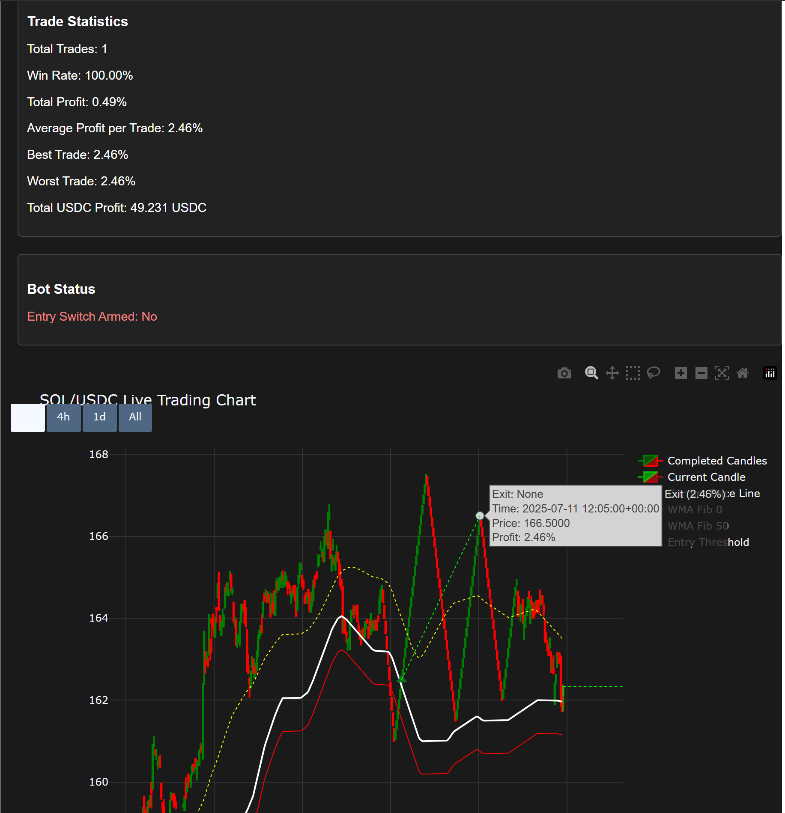

# SOL/USDC Live Trading Bot

Welcome to the **SOL/USDC Live Trading Bot** project! This bot is designed to automate trading of the SOL/USDC pair (or any pair) using a Fibonacci-based strategy. It includes features such as live charting with real-time Fibonacci levels, trade management, and performance statistics.




## Quick Start Guide: Fibonacci Bot (Minimalist)

This guide provides the essential steps to get your price tracker and trading bot running.

### What You'll Need

  * Your `sol_usd_tracker.py` script.
  * Your `main.py` script (with the `start` command).
  * All required Python packages installed in your virtual environment.
  * (You can do a pip install -r requirements.txt once you activate your venv)
  * Your virtual environment activated.

### Step 1: Start the Price Tracker

Open your terminal, navigate to your project directory, activate your virtual environment, and run the price tracker in the background:

```bash
# Optional: Clean old price data for a fresh start
rm sol_usdc_price_history_jupiter.csv

# Start the price tracker in the background
python3 sol_usd_tracker.py
```

  * **Wait 5-10 minutes** to allow the tracker to generate enough initial data.

### Step 2: Start the Trading Bot & Live Chart

Open a **new terminal tab** (or window), navigate to your project directory, activate your virtual environment, and run the bot:

```bash
# Make sure you are in a NEW terminal tab/window
python3 main.py start
```

  * Your live chart will open in your web browser, typically at `http://localhost:8051`.

### How to Stop

1.  **Stop the Trading Bot:** Go to the terminal tab running `main.py start` and press `Ctrl + C`.
2.  **Stop the Price Tracker:**
      * Find its process ID: `ps aux | grep "sol_usd_tracker.py"`
      * Terminate it: `kill <PID>` (replace `<PID>` with the ID you found).
      * *Alternatively (if all else fails):* Close your WSL terminal or run `wsl --shutdown` from Windows PowerShell/CMD to stop all WSL processes.
## Table of Contents

- [Features](#features)
- [Getting Started](#getting-started)
  - [Prerequisites](#prerequisites)
  - [Installation](#installation)
- [Configuration](#configuration)
- [Usage](#usage)
  - [Running the Bot](#running-the-bot)
  - [Simulating Live Data](#simulating-live-data)
- [Modules Overview](#modules-overview)
  - [Main Components](#main-components)
  - [Live Chart](#live-chart)
- [Trading Strategy](#trading-strategy)
- [FAQ](#faq)
- [Contributing](#contributing)
- [License](#license)

---

## Features

- **Automated Trading Strategy**: Implements a Fibonacci-based trading strategy tailored for the SOL/USDC trading pair.
- **Live Charting**:
  - Real-time candlestick chart.
  - Fibonacci levels plotted dynamically.
  - Trade markers showing entry and exit points.
  - Display of trade statistics and bot status.
- **Trade Management**:
  - Position sizing according to configuration.
  - Automatic trade entry and exit based on strategy conditions.
  - Calculation and display of trade performance metrics.
- **Configurable**:
  - Easy-to-edit configuration file (`config.yaml`) for adjusting trading parameters.
- **Backtesting Capability**:
  - Ability to test the strategy on historical data before going live.

---

## Getting Started

### Prerequisites

- Python 3.7 or higher
- [Pipenv](https://pipenv.pypa.io/en/latest/) or `pip` for managing Python packages
- Git (optional, for cloning the repository)

### Installation

1. **Clone the Repository**:

   ```bash
   git clone https://github.com/yourusername/wif-sol-trading-bot.git
   cd wif-sol-trading-bot
   ```

2. **Set Up a Virtual Environment**:

   Using Pipenv:

   ```bash
   pipenv install
   pipenv shell
   ```

   Or using `pip` and `venv`:

   ```bash
   python3 -m venv venv
   source venv/bin/activate  # On Windows use `venv\Scripts\activate`
   pip install -r requirements.txt
   ```

3. **Install Dependencies**:

   The required packages are listed in `requirements.txt`. Install them with:

   ```bash
   pip install -r requirements.txt
   ```

4. **Data Files**:

   - Place your historical data CSV file in the `data/` directory. Ensure it is named correctly as per your configuration in `config.yaml`.
   - Ensure live data CSV file (`live_data.csv`) is being updated with real-time data in the specified path.

---

## Configuration

The bot is configured using the `config/config.yaml` file. This file contains settings for:

- **Trading Parameters**:
  - `initial_balance`: Starting balance in SOL.
  - `trade_size`: Amount of SOL to use per trade.
  - `max_positions`: Maximum number of open positions.
  - Fibonacci levels and thresholds.
  - Profit targets and countdown periods.

- **Paths**:
  - Location of historical data for backtesting.
  - Location of live data for real-time trading.
  - Path to save trade history.

- **Logging and Display**:
  - Logging levels.
  - Update intervals for status display.

**Example `config.yaml`:**

```yaml
trading:
  initial_balance: 100.0
  trade_size: 1.0
  max_positions: 5
  fib_entry_threshold: 0.005
  profit_target_1: 0.02
  profit_target_2: 0.04
  cumulative_profit_target: 0.05
  countdown_periods: 5
  require_fib50_cross: true

paths:
  historical_data: data/historical_data.csv
  live_data: data/live_data.csv
  trade_history: data/trade_history.csv
```

---

## Usage

### Running the Bot

To start the trading bot, run the `main.py` file:

```bash
python main.py start
```

**Optional Arguments**:

- `--config` or `-c`: Specify a custom configuration file.

  ```bash
  python main.py start --config config/my_config.yaml
  ```

- `--interval` or `-i`: Set the check interval in seconds for live data.

  ```bash
  python main.py start --interval 60
  ```

### Simulating Live Data

If you want to simulate live data (e.g., for testing), you can adjust the `process_new_data` function to introduce delays between processing data points. This allows you to observe the bot's behavior and live charts in a controlled manner.

**Example**:

```python
# In main.py

async def process_new_data(self, csv_path):
    # ... existing code ...
    for idx, row in df.iterrows():
        # ... process data point ...
        await asyncio.sleep(1)  # Pause for 1 second between data points
```

---

## Modules Overview

### Main Components

- **`main.py`**: Entry point of the bot. Manages initialization, starting the bot, and handling shutdown signals.

- **`indicators.py`**: Contains the `FibonacciCalculator` class for calculating Fibonacci levels and checking conditions.

- **`data_handler.py`**: Manages market data, processes incoming price data, and updates data structures.

- **`trade_manager.py`**: Contains the `TradeManager` class that checks for trade entry and exit conditions based on the strategy.

- **`position_manager.py`**: Manages open positions, handles trade history, calculates profits, and manages balances.

- **`live_chart.py`**: Handles the live charting using Dash and Plotly. Displays the candlestick chart, Fibonacci levels, trade markers, and trade statistics.

- **`backtest_manager.py`**: Manages the backtesting process using historical data.

- **`logger.py`**: Handles logging and status updates for the bot.

### Live Chart

The live chart is a Dash application that displays:

- **Candlestick Chart**: Real-time price movements with completed and current forming candles.

- **Fibonacci Levels**: Plotting of the `Fib 0`, `Fib 50`, and entry thresholds.

- **Trade Markers**: Visual indicators of trade entries and exits.

- **Trade Statistics**: Display of total trades, win rate, profit metrics, and bot status.

**Accessing the Live Chart**:

By default, the live chart runs on `http://localhost:8051`. You can open this URL in your web browser to view the chart and statistics.

---

## Trading Strategy

The bot uses a Fibonacci-based trading strategy, where it calculates Fibonacci levels based on recent highs and lows. The key components of the strategy include:

- **Entry Conditions**:

  - Price touches the entry threshold below the `Fib 0` level.
  - The bot is "armed" when the price reaches this threshold.
  - Entry occurs when the price moves back above the `Fib 0` level after being armed.

- **Exit Conditions**:

  - Profit target 1: Close position if a profit target is met within a countdown of candles.
  - Profit target 2: If the countdown expires, use a different profit target.
  - Cumulative profit target: Close all positions if the cumulative profit target is reached.
  - Optionally, require the price to be below the `Fib 50` level for exits.

- **Position Management**:

  - Limit on maximum open positions.
  - Spacing between positions to avoid overexposure.

- **Risk Management**:

  - Trade sizes are set based on configuration.
  - The bot tracks balances and ensures sufficient funds are available.

---

## FAQ

**Q**: *Can I use this bot for other trading pairs?*

**A**: Yes, but you'll need to adjust the configuration and ensure the data handling accommodates the new pair.

**Q**: *Is this bot ready for live trading with real money?*

**A**: This bot is intended for educational purposes. Thorough testing, including proper backtesting and simulation, should be conducted before using it in a live trading environment with real funds.

**Q**: *How do I add more indicators or modify the strategy?*

**A**: You can extend the `indicators.py` and `trade_manager.py` modules to incorporate additional indicators and adjust the trading logic.

**Q**: *The live chart doesn't display correctly. What should I do?*

**A**: Ensure that all dependencies are installed and that the Dash application is running. Check the console for any errors and verify that the data is being processed correctly.

---

## Contributing

Contributions are welcome! If you'd like to improve the bot, add new features, or fix bugs, please follow these steps:

1. **Fork the Repository**:

   Click the "Fork" button at the top right of this page to create a copy of the repository on your account.

2. **Clone Your Fork**:

   ```bash
   git clone https://github.com/yourusername/wif-sol-trading-bot.git
   ```

3. **Create a New Branch**:

   ```bash
   git checkout -b my-feature
   ```

4. **Make Your Changes**:

   Add new features or fix issues as needed.

5. **Commit Your Changes**:

   ```bash
   git commit -am 'Add new feature'
   ```

6. **Push to Your Fork**:

   ```bash
   git push origin my-feature
   ```

7. **Submit a Pull Request**:

   Go back to the original repository and open a pull request with a description of your changes.

---

## License

This project is licensed under the **MIT License** - see the [LICENSE](LICENSE) file for details.

---

## Acknowledgments

- **Libraries Used**:
  - [Pandas](https://pandas.pydata.org/): Data manipulation and analysis.
  - [NumPy](https://numpy.org/): Numerical computing.
  - [Plotly Dash](https://plotly.com/dash/): Interactive web applications and live charting.
  - [PyYAML](https://pyyaml.org/): YAML parsing and configuration handling.
  - [Asyncio](https://docs.python.org/3/library/asyncio.html): Asynchronous I/O.

---

## Contact

For any questions or support, please open an issue on the repository or contact the maintainer.

---

*Happy Trading!* 🚀